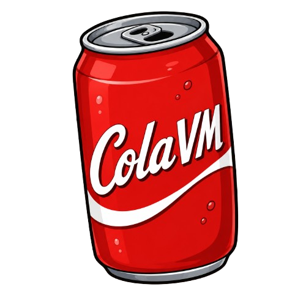

    
    <h4>A stack-based virtual machine ecosystem aimed at compact-sized binaries</h4>

# Introduction

**ColaVM Suite** is a lightweight stack-based virtual machine ecosystem with a custom ISA aimed at producing compact-sized compiled binaries.

A simple program which prints "Hello, World!" is compiled to a **can** (cola compiled binary) of just 15 bytes!

# Usage

## Runtime

The Cola runtime is called **ColaVM**. It is written completely in Rust.

### Building from source

Cargo is needed to build the project from the source.

1. Clone the repository.
2. Set the current working directory to the project root.
3. Run `cd runtime`
4. Run `cargo build --release`
5. The compiled runtime binary will be at `runtime/target/release`

### Running a compiled binary

The Cola compiled binary is called a **Can** and has a **.can** extension.

Run `./colavm <program path>`

## Assembler

The Cola assembler is called **Fill**. It is written in Python.

### Compiling Cola source code

Run `python assemble.py <code path>` or `python3 assemble.py <code path>` (for Mac).

# Documentation

The complete documentation and the specification of the ColaVM Suite can be found on the [website](https://colavm.vercel.app).
